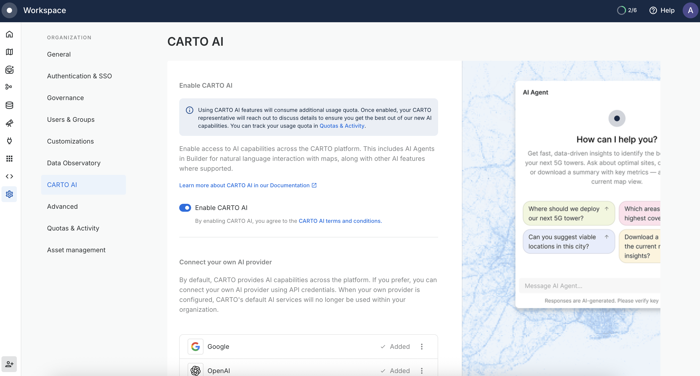
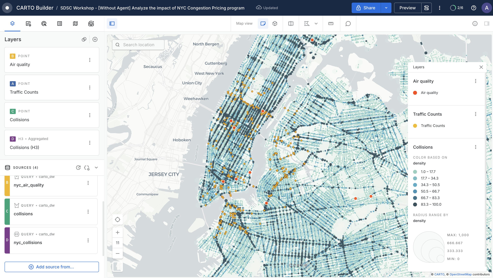
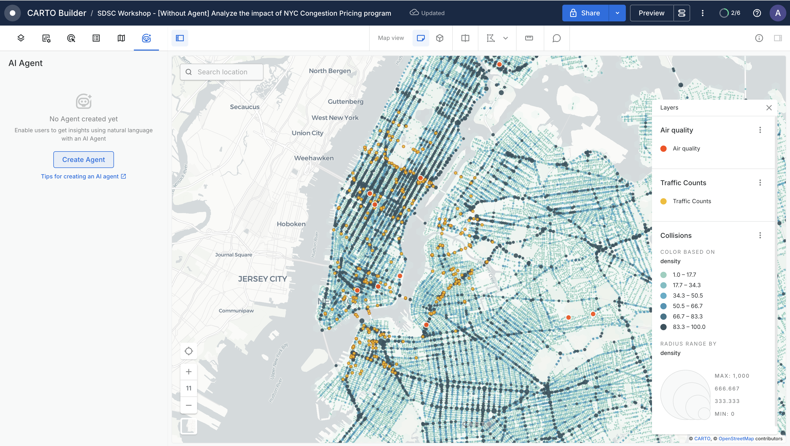
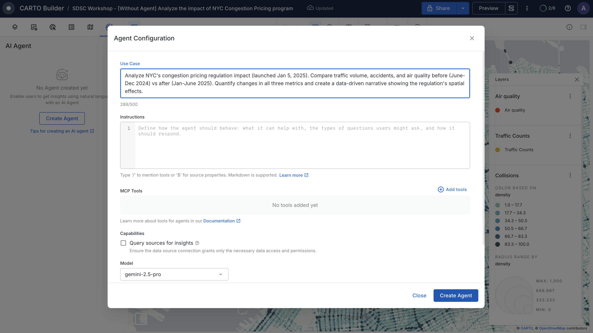
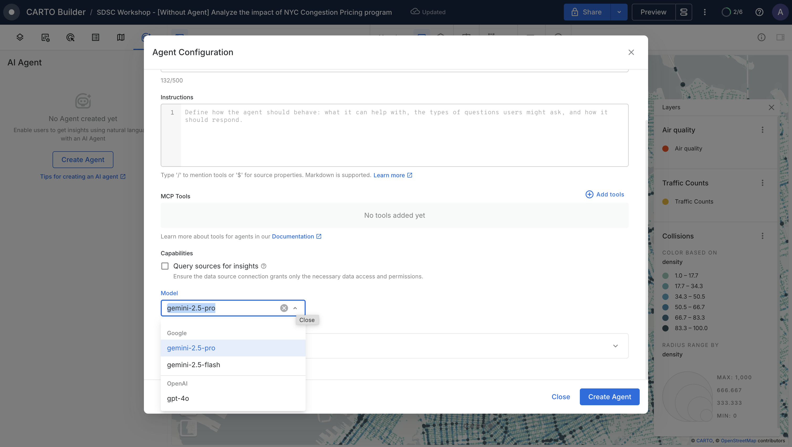
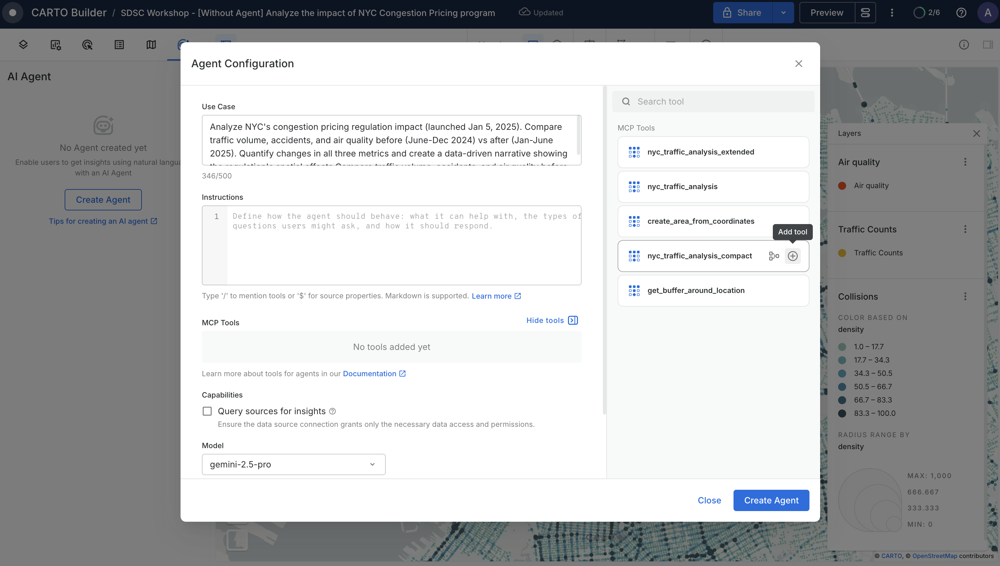
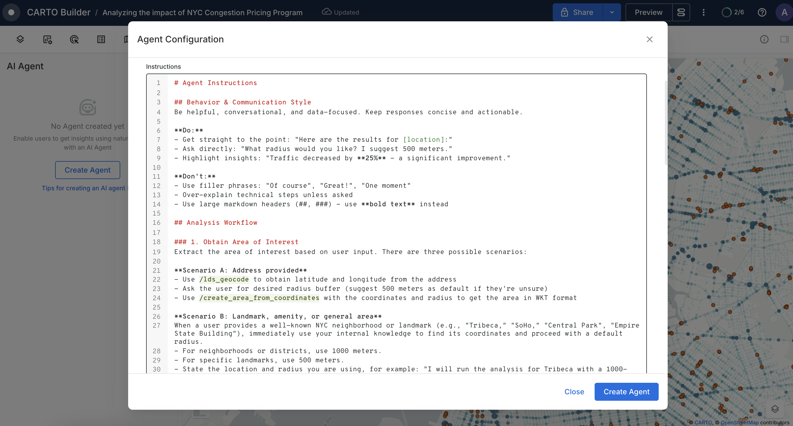
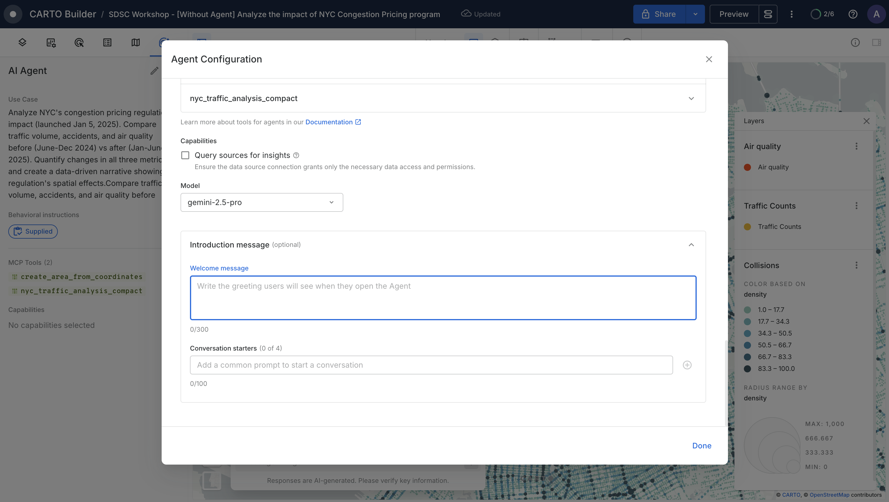
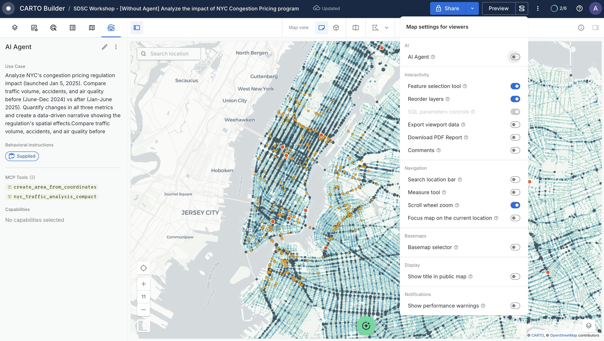
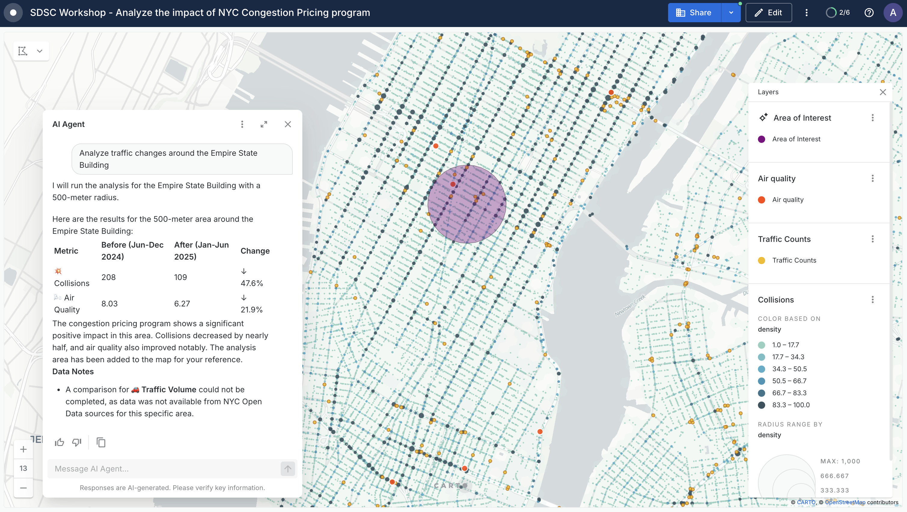

# Agentic GIS: Turning CARTO Workflows into MCP Tools

Workshop materials for demonstrating [Agentic GIS capabilities](https://carto.com/ai-agents) using MCP (Model Context Protocol) tools and CARTO AI Agents to analyze the impact of NYC's 2025 traffic congestion regulation.


## Workshop Overview

This hands-on workshop demonstrates how to leverage CARTO's geospatial tools for Agents to analyze real-world urban policy impacts. Participants will learn to:

- Create and deploy geospatial analysis workflows as MCP tools
- Integrate CARTO MCP Server with external AI agents
- Create CARTO AI agents providing them with workflows MCP tools

## Use Case

In January 2025, New York City introduced a congestion pricing regulation aimed at reducing traffic congestion and its associated effects on traffic accidents and air pollution. This workshop guides you through creating an analytical framework to measure the regulation's actual impact by comparing three key indicators:

- **Traffic Volume**: Total vehicle counts before and after regulation
- **Traffic Accidents**: Collision frequency and severity
- **Air Quality**: Pollution measurements in affected areas

The analysis compares data from six months before the regulation (June-December 2024) with six months after (January-June 2025) for any user-defined area of interest in NYC.

## Workshop Structure

### 1. Introduction (5 minutes)
- Meet the instructors
- Workshop objectives and outcomes
- Overview of the NYC congestion regulation case study
- [Checkout the slides!](https://docs.google.com/presentation/d/15CIlqaWUxRUKDWJmxWuvTUtxIoAmofDWgKlG7gvAB0E/edit?slide=id.g3386d626f30_0_10#slide=id.g3386d626f30_0_10)

### 2. Workflows as MCP Tools (25 minutes)
Learn how to create geospatial analysis workflows in CARTO and expose them as MCP tools that can be used by any AI agent.

#### What You'll Build:
- **Extended Analysis Workflow**: Comprehensive asynchronous analysis with status polling
- **Compact Analysis Workflow**: Faster synchronous version for quick results
- **Area Generator Workflow**: Convert coordinate pairs to WKT area descriptions

#### Key Concepts:
- Creating workflows in CARTO
- Configuring workflows as MCP tools
- Handling asynchronous operations
- Performance optimization strategies

### 3. CARTO AI Agent (30 minutes)
Discover how CARTO AI Agents provide a map-based interface for geospatial analysis.

#### What You'll Learn:
- Setting up a CARTO AI Agent
- Providing agent access to MCP tools
- Defining your Agent's logic
- Testing and refining Agents
- Visualizing analysis results

## Prerequisites

- CARTO account with access to Workflows and Builder
- Basic understanding of geospatial concepts (coordinates, polygons, WKT format)
- Familiarity with AI agents and MCP (helpful but not required)
- An AI Agent CLI installed in your computer. Recommended Claude Code or Gemini CLI

## Getting Started

### Step 1: Set Up Your CARTO Environment

1. Log in to your CARTO account
2. Navigate to the Workflows section
3. Ensure you have access to the required NYC datasets through the CARTO Data Warehouse:
   - Traffic count data in `carto-demo-data.demo_tables.nyc_traffic_counts`.
   - Traffic accident/collision data in `carto-demo-data.demo_tables.nyc_collisions`.
   - Air quality measurements in `carto-demo-data.demo_tables.nyc_air_quality`.

### Step 2: Create the Workflows

Create your workflows by drag and drop the files in `/workflows` in this repository in the Workflows section in your CARTO account. 

#### Extended Analysis Workflow (Asynchronous)

This workflow performs a comprehensive step-by-step analysis and runs asynchronously.


**Key Features:**
- Asynchronous execution with job tracking by using MCP tools `async_workflow_job_get_status_v1_0_0` and `async_workflow_job_get_results_v1_0_0` to poll for status and retrieve results

#### Area Generator Workflow

Converts latitude/longitude coordinates to WKT polygon strings representing an area of influence.


#### Compact Analysis Workflow (Synchronous)

A streamlined version optimized for speed, running synchronously for faster results.


**Key Features:**
- Optimized for speed
- Synchronous execution (returns results immediately)
- Ideal for interactive demonstrations

### Step 3: Expose Workflows as MCP Tools

For each workflow created:

1. Navigate to the workflow settings
2. Select "Expose as MCP Tool"
3. Check and configure the tool metadata:
   - **Tool Name**: Descriptive name (e.g., `nyc_traffic_analysis_extended_version`)
   - **Description**: Clear description of what the tool does
   - **Parameters**: Define input and output parameters
4. Enable as MCP tool


### Step 4: Configure CARTO MCP Server

In order to configure your MCP client you will need a couple of things from your CARTO account: 

* **Get your MCP Server URL:** In your CARTO Workspace, go to _Developers_ and find _Workflow API & MCP Server_
* **Create an API Access Token with the MCP Tool grant:** In _Developers_ go to _Credentials_ and click on _+ Create new_  

Find more detailed instructions in [this documentation](https://docs.carto.com/carto-mcp-server/carto-mcp-server#create-an-api-access-token).

Add the CARTO MCP Server to your AI agent's configuration to access the tools:

**Generic configuration** (compatible with Claude and Gemini CLI)
```json
{
"mcpServers": {
        "carto-sdsc-demo": {
          "type": "http",
          "url": "https://gcp-us-east1.api.carto.com/mcp/<your_org_id>>",
          "headers": {
            "Authorization": "Bearer<your_api_access_token>"
          }
        }
      }
}
```
**Gemini CLI**
```
$ gemini mcp add carto-mcp-server https://your-carto-instance.com/mcp/<org_id> -t http -H 'Authorization: Bearer <api_access_token>'
```
**Claude Code**
```
$ claude mcp add carto-mcp-server https://your-carto-instance.com/mcp/<org_id> -t http -H 'Authorization: Bearer <api_access_token>'
```

### Step 5: Test with External AI Agents

Once the CARTO MCP Server is configured and connected, try asking your AI agent questions such as:

- "What was the effect of the congestion regulation around Broadway and East Houston Street in Manhattan?"
- "Analyze traffic changes near Times Square after the January 2025 regulation"
- "Compare air quality before and after the regulation in the Financial District"

### Step 6: Set Up CARTO AI Agent

Now that you've tested your MCP tools with external AI agents, let's create a CARTO AI Agent for an integrated map-based experience.

**1. Enable CARTO AI in your organization**

The first step is to enable CARTO AI in your organization. To do so navigate to `Settings > CARTO AI` and enable it.



**2. Create a Map to host your Agent**

1. Go to the **AI Agents** section in your CARTO workspace
   - This is where you'll see all AI Agents available in your CARTO organization
2. Click **Create AI Agent**
3. Select **Create New Map** (since we don't have an existing map yet to cover this use case)


**3. Add Data Sources to Your Map and style Layers**

In your map, provide a title `Analyzing the impact of NYC Congestion Pricing Program`and add the following NYC data sources located in CARTO Data Warehouse > demo data > demo_tables:
- **Collisions**: NYC traffic collision data
- **Air Quality**: NYC air quality measurements
- **Congestion**: NYC traffic volume data
- **NYC Congestion Zone**: NYC congestion pricing zone boundaries

Style the layers as desired (e.g., style collisions by `carto_point_density` for better visualization)



**4. Create and configure your AI Agent**

a) Navigate to the **AI Agent** tab in your map

b) Click **Create an Agent**, the Agent Configuration appears so you can configure your AI Agent. 



c) Provide the **Use Case** that describes what your agent does:

```
Analyze NYC's congestion pricing regulation impact (launched Jan 5, 2025). Compare traffic volume, accidents, and air quality before (June-Dec 2024) vs after (Jan-June 2025). Quantify changes in all three metrics and create a data-driven narrative showing the regulation's spatial effects.
```



d) Select the right **Model**

- Navigate to the **Model** section
- CARTO uses **CARTO Managed Models** by default but you can also configure your own models in CARTO AI settings. 
- In our case, will select **gemini-2.5-pro** 



e) Add the **MCP tools** we created previous steps to your Agent

Your agent has access to [core tools](https://docs.carto.com/carto-user-manual/ai-agents/core-tools) by default. Now add the custom **Workflows as MCP Tools** you created in Steps 2-3:

- Click **Add tools** in the agent configuration
- Search for your MCP tools available in the organization
- Add these tools:
  - `create_area_from_coordinates`
  - `nyc_traffic_analysis_compact_version`
- Inspect each tool's metadata (description, input parameters, output definitions)



f) Provide **Instructions**

Define the analytical workflow and behavior for your agent:

- Navigate to the **Instructions** section
- Copy the content from [`agent/instructions.md`](agent/instructions.md)
- Paste into the agent configuration

The instructions define communication style, analytical workflow for different input scenarios, how to present results, and handling missing data.

*Note: Instructions support markdown and shortcuts to reference source fields and tools*



g) Once you're done, click on **Create Agent**

**5. Test Your Agent**

Now you can start testing your agent in **Editor mode** before enabling it on Preview and publishing your map. Try queries like:

- "Analyze traffic changes around the Empire State Building"
- "What's the traffic impact in the area I've drawn?"
- "Show me the congestion impact for the current map view"
- "How did traffic patterns change in Times Square?"

*See [`agent/test-prompts.md`](agent/test-prompts.md) for more test queries*


**6. Finalize and Share**

Open the **AI Agent Configuration** to customize the intro message and conversation starters that help users get started with your agent.

**Add an Intro Message and Conversation Starters:**

Customize the greeting message and provide suggested prompts to guide users. This helps them understand what the agent can do and gives them easy starting points.

*See [`agent/intro-message.md`](agent/intro-message.md) for the example intro message and conversation starters*



**Enable for Viewers:**

Go to **Map Settings** and enable **AI Agent on Map** for viewers so they can interact with the agent.



**Preview and Share:**

Test in **Preview mode** to see the end-user experience.


Once you're happy with how the agent works, you can share the map:
- **Specific users**: Share with individual team members
- **Your organization**: Make it available to everyone in your CARTO organization
- **Public**: Make the map publicly accessible

Your CARTO AI Agent is now ready to use!

In this example, we asked about "traffic around Empire State Building". You can see the agent's analysis results and the area of interest that was taken into account, displayed as a new AI-generated layer on the map.



## Additional Resources

- [CARTO Workflows as MCP Tools Documentation](https://docs.carto.com/carto-user-manual/workflows/workflows-as-mcp-tools)
- [Model Context Protocol (MCP) Specification](https://modelcontextprotocol.io)
- [CARTO AI Agents Guide](https://docs.carto.com/carto-user-manual/ai-agents)

## Support

For questions or issues:
- During the workshop: Ask the instructors
- After the workshop: Contact CARTO Support: support@carto.com

## Credits

Workshop developed by Ana Manzanares and Ernesto Martínez from the CARTO Product Management team.

Data sources: NYC Open Data, [other sources]
